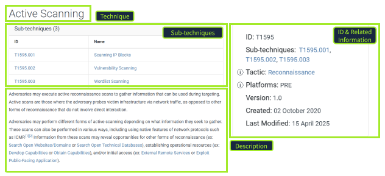
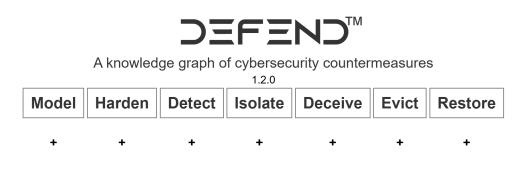
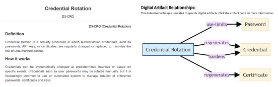

# MITRE ATT&CK Framework

| | |
|---|---|
| **Date Completed** | 15/04/2026 |
| **Difficulty** | Easy |
| **Room Link** | [tryhackme.com/room/mitre](https://tryhackme.com/room/mitre) |

---

## :clipboard: Overview

This room introduces the MITRE ATT&CK® framework, a globally accessible knowledge base of adversary tactics, techniques, and procedures used to describe and understand threat actor behaviour. Working through a realistic scenario as a security analyst in the aviation sector, I applied ATT&CK to profile a known APT group, identify relevant techniques, and explore complementary frameworks including CAR and D3FEND.

---

## :dart: Key Learning Objectives

- [x] Understand the purpose and structure of the MITRE ATT&CK® Framework
- [x] Explore how security professionals apply ATT&CK in their work
- [x] Use cyber threat intelligence (CTI) and the ATT&CK Matrix to profile threats
- [x] Discover MITRE's other frameworks, including CAR and D3FEND

---

## :pencil: Notes

### Task 1: ATT&CK Core Concepts

I started by learning the three fundamental building blocks of the framework. A **Tactic** is the adversary's goal, the "why" of an attack. A **Technique** describes how that goal is achieved. A **Procedure** is the specific implementation, how the technique is actually executed in the wild. This consistent language is what makes ATT&CK so valuable across both threat intelligence and defensive operations, giving analysts a shared vocabulary when triaging alerts or writing detections.

The screenshot below shows the ATT&CK website entry for Active Scanning (T1595), a Reconnaissance technique, illustrating how techniques are structured alongside their sub-techniques, tactic, platform, and metadata.

!!! info "Why ATT&CK Matters"
    ATT&CK bridges the gap between raw threat intelligence and defensive operations. By mapping alerts to specific techniques, analysts can prioritise incidents and communicate findings in a structured, universally understood way.

### Task 2: Applying ATT&CK to a Real Scenario

The scenario placed me as a security analyst at an aviation company migrating infrastructure to the cloud. My task was to use the ATT&CK Groups section to identify an APT group known to target this sector and analyse its behaviour using the Navigator layer.

I identified the relevant threat actor, which has been active since at least 2013 and has a documented history of targeting aviation organisations. From there I examined which sub-techniques this group uses, focusing specifically on those relevant to a cloud environment and Office 365 accounts. I traced a specific tool linked to both the group and the sub-technique in question, then reviewed the recommended mitigation strategy, which emphasises removing inactive or unused accounts to reduce exposure.

!!! tip "Using ATT&CK Navigator"
    The Navigator layer is the fastest way to visualise which techniques a specific group uses and where your defensive gaps might be. Filtering by group gives you an immediate heat map of your risk surface.

### Task 3: Detection Strategy

After identifying the threat, I looked up the corresponding detection strategy ID for monitoring abused or compromised cloud accounts. This connected the ATT&CK framework directly to actionable detection work, showing how intelligence findings translate into SOC priorities.

### Task 4: D3FEND

I explored D3FEND (Detection, Denial, and Disruption Framework Empowering Network Defense), a complementary framework that maps defensive techniques using a common language. The framework organises countermeasures across seven high-level categories, as shown below.

A specific technique I studied was Credential Rotation (D3-CRO), which recommends the regular rotation of passwords, API keys, and certificates to prevent attackers from reusing stolen credentials.

D3FEND is designed to complement ATT&CK by providing the defensive counterpart to each offensive technique.

---

## :wrench: Tools Used

| Tool | Purpose |
|---|---|
| [ATT&CK Navigator](https://mitre-attack.github.io/attack-navigator/) | Visualising APT group technique coverage and defensive gaps |
| [MITRE ATT&CK](https://attack.mitre.org) | Researching APT groups, techniques, mitigations, and detections |

---

## :bulb: Key Takeaways

1. ATT&CK gives analysts a shared language that makes it possible to turn raw threat intelligence into prioritised, actionable defensive work.
2. The Groups section is an underused starting point for understanding who is likely to target your sector and exactly how they operate.
3. Mitigations and detections are tied directly to techniques, so moving from "we were targeted" to "here is what we should monitor and block" is a structured, repeatable process.
4. D3FEND complements ATT&CK by mapping the defensive side, making it easier to design layered controls rather than reacting to individual alerts.
5. Cloud migrations increase the attack surface in specific, predictable ways. Cross-referencing your environment changes against ATT&CK cloud techniques before you migrate is a proactive habit worth building.